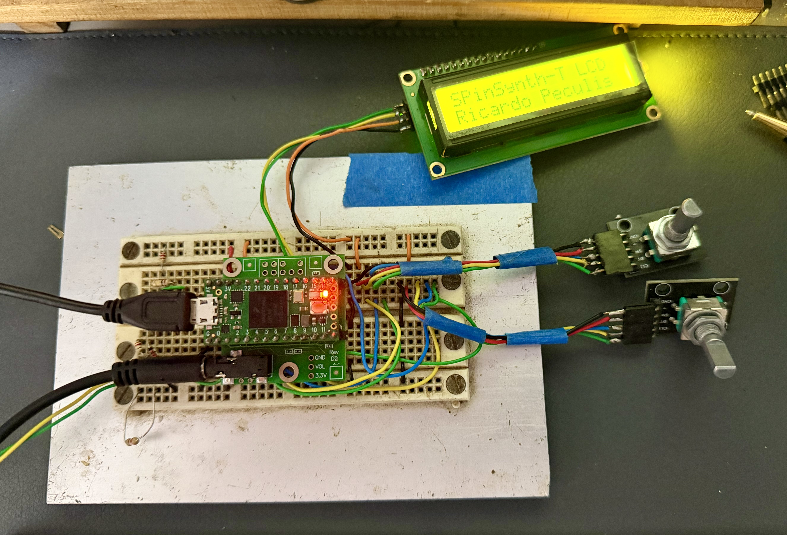

# SPinSynth-T-LCD

SPinSynth-T-LCD is a monophonic software synthesizer for Teensy 4.0. It combines Ricardo Peculis's custom synthesis engine with the PJRC Teensy Audio Library, MIDI-DIN, USB MIDI, simultaneous USB/Audio-Shield audio, and a local LCD/rotary-encoder HMI.

> **Project status:** experimental, working hardware baseline. This is not a finished product.

## Validated hardware baseline

- Teensy 4.0 at 600 MHz
- PJRC Audio Shield Rev D2
- KEYES DC 3.3 V LCD1602 I2C module at address `0x27`
- Two quadrature rotary encoders with push-buttons
- Isolated 5-pin MIDI-DIN input
- USB configured as **Serial + MIDI + Audio**
- Simultaneous stereo USB Audio and Audio Shield output carrying the mono synth signal

The 3.3 V LCD connects directly to Teensy pins 18 and 19. No I2C logic-level shifter is used. The LCD has no local pull-ups; the Audio Shield supplies 2.2 kΩ pull-ups to 3.3 V.



See [docs/HARDWARE.md](docs/HARDWARE.md) for pin assignments, controls, electrical details, and the history of the LCD, level-shifter, Audio Shield, and USB investigations.

## Features

- Monophonic, highest-note-priority keyboard behavior
- Sine, saw, square, pulse, and `XTREME` oscillator modes
- Detuned saw, pulse, and sub-oscillator layers in `XTREME` mode
- Oscillator and filter LFOs
- Resonant filter
- Separate amplifier and filter ADSR envelopes
- Portamento, pitch bend, velocity, master tuning, and master volume
- USB MIDI plus 5-pin MIDI-DIN input
- Simultaneous USB Audio and PJRC Audio Shield Rev D2 output
- 16x2 LCD and two-encoder parameter interface
- Heartbeat, CrashReport, uptime, temperature, and startup I2C diagnostics

## Software dependencies

- Arduino IDE with Teensy support
- PJRC Audio and Encoder libraries
- FortySevenEffects MIDI Library
- Frank de Brabander/Marco Schwartz `LiquidCrystal_I2C` library exposing `LiquidCrystal_I2C(address, columns, rows)`, `init()`, and `backlight()`

The validated workstation used Teensy board package 1.62.0, MIDI Library 5.0.2, LiquidCrystal I2C 1.1.2, and macOS 15.7.3.

## Build and upload

1. Open `SPinSynth-T-LCD/SPinSynth-T-LCD.ino` in Arduino IDE.
2. Select **Teensy 4.0** under **Tools > Board**.
3. Select **Serial + MIDI + Audio** under **Tools > USB Type**.
4. Select 600 MHz CPU speed.
5. Compile and upload.
6. Open Serial Monitor at 9600 baud for startup and operational diagnostics.

The sketch stops compilation when the selected USB type does not include Audio.

After startup, confirm LCD I2C address `0x27` and SGTL5000 address `0x0A` both report status `0`. The SGTL5000 headphone volume is initialized to `0.85`; begin headphone tests with the HMI volume low.

## Tested baseline

The production configuration completed a continuous test exceeding five hours with MIDI-DIN, USB Audio, Audio Shield audio, LCD/HMI, and heartbeat operating normally. CPU temperature reached 54.3 °C. After removal of temporary test code, the production build completed an additional ten-minute CAT with all functions correct at 57.5 °C on a 28 °C day.

See [docs/TESTED_BASELINE.md](docs/TESTED_BASELINE.md) for the complete regression checklist.

## Repository layout

```text
SPinSynth-T-LCD/
├── README.md
├── docs/
└── SPinSynth-T-LCD/
    ├── SPinSynth-T-LCD.ino
    ├── SPinSynthAudio.*
    ├── SPinSynthHMI.*
    └── synthesis engine sources
```

The nested sketch directory is intentional: Arduino requires the primary `.ino` file to match its containing directory.

## Contributing

Please keep changes small and repeat the regression checklist after modifications. See [CONTRIBUTING.md](CONTRIBUTING.md).

## License

No open-source license has been selected yet. Until the copyright owner adds a license, the source is provided for viewing only under standard copyright law.
