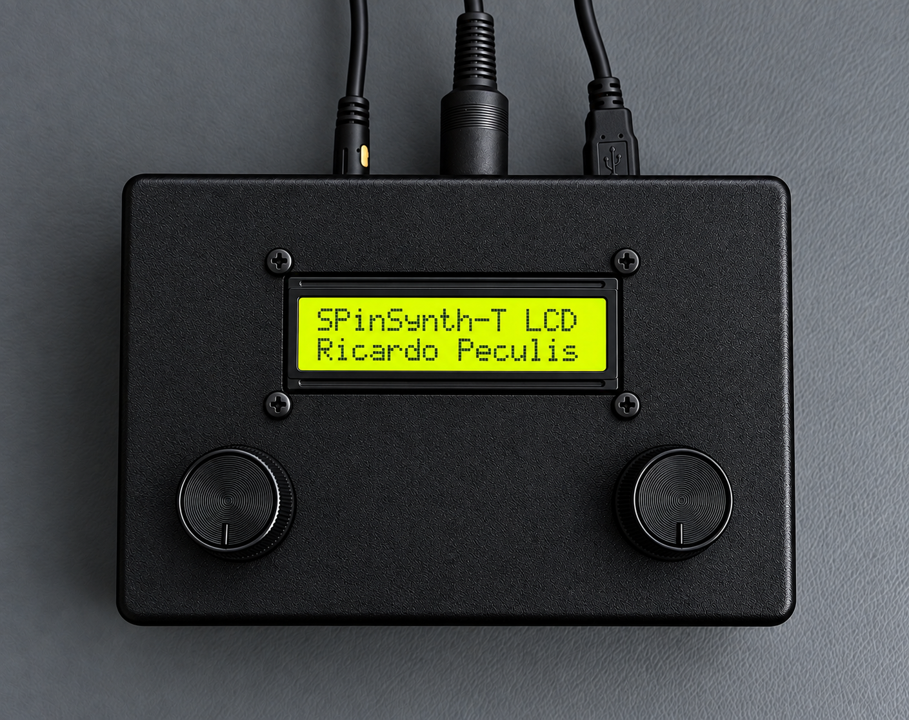
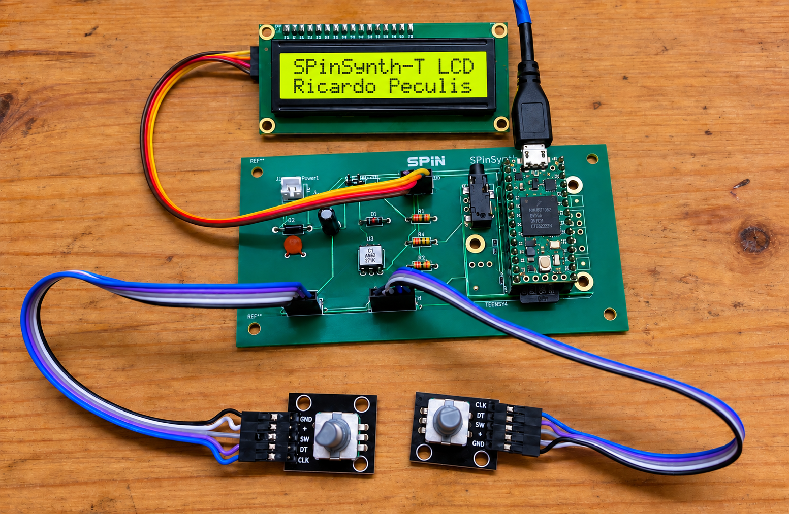

# Hardware and controls

## Validated configuration — 5–6 August 2026

The current SPinSynth-T-LCD baseline is:

- Teensy 4.0 running at 600 MHz
- PJRC Audio Shield Rev D2 stacked directly beneath the Teensy
- KEYES DC 3.3 V LCD1602 I2C module at address `0x27`
- Two rotary encoders with push-buttons
- Isolated MIDI-DIN input
- USB configured as Serial + MIDI + Audio
- Simultaneous USB Audio and Audio Shield output
- Audio Shield headphone volume initialized to `0.85`

## Pin assignment

| Function | Teensy pin |
| --- | ---: |
| Left encoder A | 2 |
| Left encoder B | 3 |
| Left encoder push-button | 4 |
| Right encoder A | 5 |
| Right encoder B | 9 |
| Right encoder push-button | 14 |
| LCD SDA | 18 |
| LCD SCL | 19 |

Encoder buttons use the Teensy's internal pull-ups and connect their pins to ground when pressed. The right encoder uses pins 5 and 9 to stay clear of Audio Shield SPI connections.

## LCD and I2C electrical configuration

The KEYES LCD is powered from 3.3 V and connects directly to the Teensy I2C bus:

| Signal | Connection | Electrical level |
| --- | --- | --- |
| SDA | Teensy pin 18 | 3.3 V |
| SCL | Teensy pin 19 | 3.3 V |
| VCC | Teensy 3.3 V | 3.3 V |
| GND | Common ground | 0 V |

The LCD module has no I2C pull-ups. The Audio Shield supplies 2.2 kΩ pull-ups on SDA and SCL to 3.3 V, so no additional pull-ups or logic-level shifter are required. With SPinSynth and its HMI operating, SDA and SCL each measured approximately 3.25 V in their idle-high state while the 3.3 V supply remained steady.

## HMI behavior

- Turn the left encoder to select a parameter.
- Turn the right encoder to change the selected value.
- Press the left button to move to the next parameter group.
- Press the right button to toggle fine/coarse editing.
- Press both buttons to return to the home screen.
- Long-press the right button to restore the selected parameter default.
- On the main pulse-waveform screen, press the left button to enter or leave pulse-width editing.
- MIDI changes are reflected on the LCD.

## MIDI interfaces

The sketch listens to USB MIDI and MIDI-DIN on Teensy `Serial1` through the FortySevenEffects MIDI Library. The DIN input requires the standard isolated MIDI input circuit; never connect a 5-pin DIN socket directly to a Teensy GPIO pin.

The tested DIN controller sends unsolicited CC 82 value 0 messages. The DIN-specific handler ignores CC 82 so these messages cannot mute amplifier sustain. USB MIDI retains the complete CC mapping, including CC 82.

## Main MIDI CC map

| CC | Function |
| ---: | --- |
| 1 | Mod wheel |
| 7 | Master volume |
| 16–17 | Oscillator LFO rate and amount |
| 18 | Mod-wheel function |
| 19 | Filter envelope amount |
| 35 | Portamento |
| 36 | Stereo reverb dry/wet mix |
| 37–44 | Oscillator shape controls |
| 71, 74 | Filter resonance and cutoff |
| 72–73, 75, 79 | Filter envelope |
| 76–77, 93 | Filter LFO |
| 80–83 | Amplifier envelope |
| 91 | Oscillator LFO waveform |

Pitch bend is handled separately. The complete mapping and value ranges appear near the top of the primary sketch.

## LCD and level-shifter history

Teensy 4.0 I/O pins are not 5 V tolerant. The former LCD1602 assembly was a 5 V I2C device, so a bidirectional level shifter was introduced between the Teensy and LCD.

An HW-024 V0.1 two-channel module was initially wired according to incomplete and conflicting identification information. Investigation established that this particular board's A side was the high-voltage side and its B side was the low-voltage side, opposite the assumption used during assembly. The system sometimes appeared to work with the sides reversed, but this was neither valid nor safe. Back-powering through SDA and SCL could leave the nominal 5 V LCD rail near 4.5 V even after its explicit 5 V connection was removed.

After correcting the HW-024 wiring, intermittent audio stoppages, elevated Teensy temperatures, and unreliable LCD operation continued. The HW-024 was removed. A conventional BSS138 bidirectional module then operated correctly with LV at 3.3 V and HV at 5 V, confirming that Teensy, firmware, and LCD traffic could work with a correctly implemented translator.

The final solution replaced the 5 V display with a KEYES LCD1602 specified for native 3.3 V operation. This eliminated the voltage-domain crossing, level shifter, and back-powering path. It is the cleanest and preferred configuration.

## Audio Shield history

Several earlier Audio Shields produced no analog output even though the expected I2S clocks and data were present. In one investigated board, installing the Shield collapsed the 3.3 V rail to approximately 1.62 V while both Teensy boards operated normally without it. That Shield had never been used on the SPinSynth protoboard and was treated as defective rather than evidence that the project damaged it.

The current PJRC Audio Shield Rev D2 was installed after checking assembly and supply behavior. Its SGTL5000 responds at I2C address `0x0A`; enable, headphone routing, volume, and unmute operations succeed. The synth is routed simultaneously to USB Audio and stereo I2S. Headphone volume was progressively validated at 0.25, 0.50, 0.75, and finally 0.85.

## USB stability history

During early tests, Logic Pro intermittently lost USB Audio while Shield audio, MIDI-DIN, LCD/HMI, and heartbeat continued. macOS Audio MIDI Setup also temporarily lost the Teensy device, proving this was a complete USB data disconnection rather than a synth crash or Logic-only failure.

Replacing the micro-USB cable and cleaning the connectors with isopropyl alcohol eliminated the dropouts during the subsequent five-hour test. The result identifies the prior instability as a cable/contact problem. Mechanically support the USB cable near the Teensy so its weight does not stress the micro-USB connector.

## Operational diagnostics

The production firmware retains lightweight diagnostics:

- Teensy `CrashReport` at startup
- Built-in LED heartbeat
- Uptime and CPU temperature every five seconds
- LCD I2C status at startup; status `0` indicates success
- SGTL5000 I2C status at startup; status `0` indicates success

Temporary continuous-tone, USB-only, and conditional HMI polling test paths were removed after validation.

## PCB and enclosure documentation

[Circuit diagram](SPinSynth-T-LCD-Hardware.pdf). Photos supplied by Ricardo Peculis on 5 October 2026.
